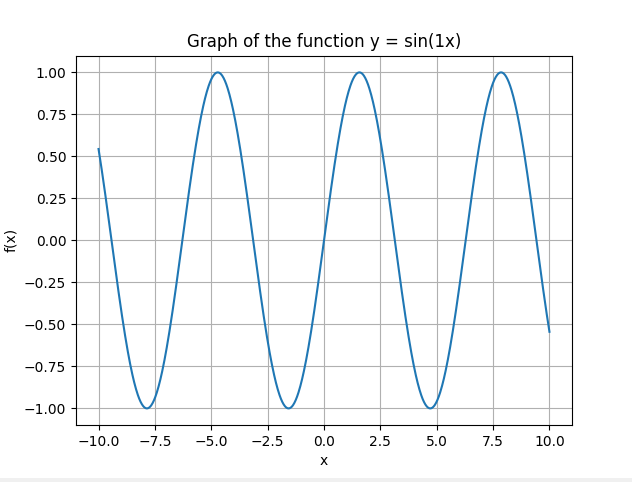

# Derivative and Limit Calculator

## This Python script provides tools for performing fundamental calculus operations including calculating derivatives, limits, and plotting functions.

Features:

- Derivative Calculator: This function, derivative(), computes the nth derivative of a given function with respect to a specified variable. It also accepts symbolic expressions, converting them into a format suitable for computation.

- Limit Calculator: The function lim() computes the limit of a given function as a specified variable approaches a certain value. It can handle limits approaching from the left or the right, or the general limit.

- Function Plotting: The plot_graph() function visualizes a given function across a specified range of the independent variable. It can be useful for understanding the function's behavior visually.

All results are copied to the clipboard for further use.

The script provides a command-line interface where users can choose the operation they want to perform, input the function and the corresponding parameters.

An example derivative session:

```
Please enter a number:
1
Example input:
x^3 + 2x^2 + 1x
sqrt(1x) + sin(1x)
Please enter the function you would like to calculate the derivative for:x^3 + 2x^2 + 1x
Please enter the derivative # you would like to calculate for the function: 'x^3 + 2x^2 + 1x':
1
The #1 derivative of the function x^3 + 2x^2 + 1x with respect to x is:
3*x**2 + 4*x + 1
Solution copied to clipboard.
Press enter to return to the main menu...
```

An example limit session:

```
Please enter a number:
2
Example input:
5x+pi
Please enter the function you would like to calculate the limit for: 5x^2
(enter 'oo' for infinity)
Please enter the limit # you would like to calculate for the function '5x^2': 2
Enter 'l' for left approach, 'r' for right approach, or 'none': l
The limit of the function 5x^2 as x approaches 2 from the left is: 20
limx->2-(5x^2)
Solution copied to clipboard.
Press enter to return to the main menu...
```

An example of plotting a graph after inputting the function sin(1x):


Dependencies:

The script uses the following libraries:

- Sympy: For symbolic computation.
- NumPy: For numerical computation.
- Matplotlib: For plotting the functions.
- Pyperclip: For copying the results to the clipboard.

Please install these dependencies before running the script.

This calculator uses Python's symbolic computation library (Sympy) which provides extensive capabilities for symbolic calculus. Thus, it is able to handle a wide variety of functions, including trigonometric functions, exponentials, logarithms, and other special functions.

Note:
When inputting 5x+x as an example, you must have a 1 before the x like 5x+1x. If you do not do this, you will encounter errors.

When inputting 5x+2 as an example, do not input it as 5\*x+2, otherwise the input in the calculation would become 5\*\*x+2 which will create errors.

For powers, you can do 5^2 or 5\*\*2, both are the same.
